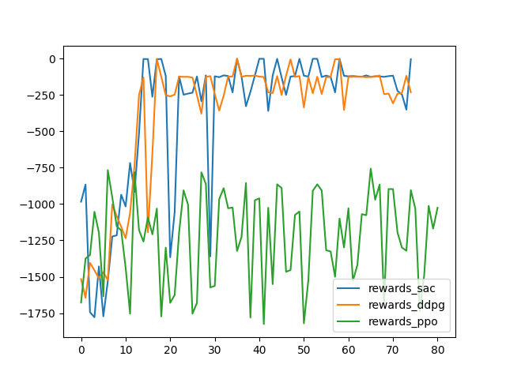

# rl-laboratory
MAP670C Reinforcement Learning - Course assignments

# How to install ?
In order to run this project here are few steps you have to complete

**Step 0** : Open your favorite terminal

**Step 1** : Clone the repo
```
$ git clone https://github.com/Minozar/rl-laboratory
```

**Step 2** : Create a python virtual environment
```
$ cd rl-laboratory
$ python -m venv venv-name
```

**Step 3** : Run the virtual environment

```
# Windows PowerShell
$ venv-name\Scripts\activate.ps1

# Linux terminal (bash)
$ source venv-name/bin/activate
```

**Step 4** : Install the dependencies

```
$ pip install -r requirements.txt
```
Now you are ready to go !

# How to run the project ?
The project is quite simple at the moment
To start the benchmarking, simply run the following command :

```
$ python ./main.py
```

And then, to compute the final graph :
```
$ python ./benchmark_results.py
```

# Results


Our first Soft Actor Critic best model trained on BipedalWalker-v3 with `total_timesteps = 500000`. 


Our first Double Deterministic Policy Gradient best model trained on BipedalWalker-v3 with `total_timesteps = 500000`.


Our first Proximal Policy Optimization  best model trained on BipedalWalker-v3 with `total_timesteps = 500000`.


